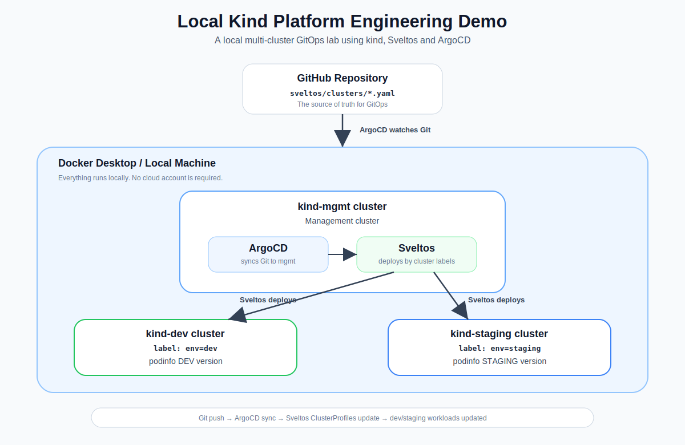

# Local Kind Platform Engineering Demo

A beginner-friendly, fully local **multi-cluster Kubernetes GitOps platform demo** using **kind**, **Sveltos** and **ArgoCD**.

This project runs completely on your own computer with Docker Desktop. You do **not** need AWS, Azure, GCP or any cloud account.

The goal is to learn how a platform engineering workflow works:

```text
Git push
  -> ArgoCD syncs changes from GitHub
  -> Sveltos reads the ClusterProfiles
  -> Sveltos deploys the application to dev and staging clusters
```

## Why I Built This

I wanted a Windows-friendly local lab for learning:

- multi-cluster Kubernetes
- GitOps
- ArgoCD
- Sveltos
- label-based cluster targeting
- platform engineering basics

The original idea is similar to local multi-cluster demos using vCluster/vind, but this version uses **kind** because it works more reliably on Windows with Docker Desktop.

## Architecture



```text
GitHub Repository
        |
        v
ArgoCD on mgmt cluster
        |
        v
Sveltos ClusterProfiles on mgmt cluster
        |
        v
+----------------------+----------------------+
|                                             |
v                                             v
dev cluster                                  staging cluster
podinfo DEV                                 podinfo STAGING
```

## Simple Explanation

This project creates three local Kubernetes clusters:

| Cluster | Purpose |
| --- | --- |
| `mgmt` | Management cluster. Runs Sveltos and ArgoCD. |
| `dev` | Workload cluster for the development environment. |
| `staging` | Workload cluster for the staging environment. |

The `mgmt` cluster controls the other clusters.

ArgoCD watches this GitHub repository.

Sveltos deploys applications to the correct cluster based on labels:

```text
env=dev      -> deploy DEV version
env=staging  -> deploy STAGING version
```

## What This Project Demonstrates

- Creating multiple local Kubernetes clusters with kind
- Using one Kubernetes cluster as a management cluster
- Registering external clusters into Sveltos
- Deploying applications across multiple clusters with Sveltos
- Selecting clusters by labels
- Installing ArgoCD with Sveltos
- Creating a GitOps loop with GitHub and ArgoCD
- Running everything locally without cloud cost
- Automating the setup with PowerShell and Bash scripts

## Tools Used

- [Docker Desktop](https://www.docker.com/products/docker-desktop/)
- [kind](https://kind.sigs.k8s.io/)
- [kubectl](https://kubernetes.io/docs/tasks/tools/)
- [Helm](https://helm.sh/)
- [Sveltos](https://projectsveltos.github.io/sveltos/)
- [ArgoCD](https://argo-cd.readthedocs.io/)
- [Git](https://git-scm.com/)
- PowerShell
- Bash

## Repository Structure

```text
local-kind-platform/
│
├── clusters/
│   ├── mgmt.yaml
│   ├── dev.yaml
│   └── staging.yaml
│
├── sveltos/
│   ├── mgmt/
│   │   ├── clusterprofile-argocd.yaml
│   │   ├── argocd-app-sveltos.yaml
│   │   ├── dev-sveltoscluster.yaml
│   │   └── staging-sveltoscluster.yaml
│   │
│   └── clusters/
│       ├── podinfo-dev.yaml
│       └── podinfo-staging.yaml
│
├── scripts/
│   ├── setup.ps1
│   ├── destroy.ps1
│   ├── setup.sh
│   └── destroy.sh
│
├── docs/
│   └── architecture.svg
│
├── .gitignore
├── LICENSE
└── README.md
```

## Prerequisites

Install these tools before starting.

### Required for Windows

- Docker Desktop
- Git
- kubectl
- kind
- Helm
- PowerShell

You can check whether they are installed with:

```powershell
docker --version
git --version
kubectl version --client
kind version
helm version
```

If one of these commands is not recognized, install that tool first.

## Important: GitHub Repository Setup

ArgoCD runs inside Kubernetes. It cannot read files directly from your local computer.

For the GitOps part to work, this project must be pushed to a GitHub repository.

### 1. Create a GitHub repository

Create a new GitHub repository, for example:

```text
local-kind-platform
```

A public repository is easier for this demo. If you use a private repository, you will need to configure ArgoCD repository credentials.

### 2. Push this project to GitHub

From the project root:

```powershell
git init
git add .
git commit -m "Initial local kind platform demo"

git remote add origin https://github.com/<your-username>/local-kind-platform.git
git branch -M main
git push -u origin main
```

Replace `<your-username>` with your own GitHub username.

Example:

```powershell
git remote add origin https://github.com/Kaan-YASSIBAS/local-kind-platform.git
```

### 3. Update the ArgoCD repo URL

Open this file:

```text
sveltos/mgmt/argocd-app-sveltos.yaml
```

Change the `repoURL` field to your own GitHub repository:

```yaml
source:
  repoURL: https://github.com/<your-username>/local-kind-platform.git
  targetRevision: HEAD
  path: sveltos/clusters
```

Then commit and push the change:

```powershell
git add sveltos/mgmt/argocd-app-sveltos.yaml
git commit -m "Configure ArgoCD repository URL"
git push
```

Without this step, ArgoCD will not know which repository to watch.

## Quick Start

The easiest way is to use the setup script.

### Windows PowerShell

Run PowerShell from the project root.

```powershell
Set-ExecutionPolicy -Scope Process -ExecutionPolicy Bypass
.\scripts\setup.ps1
```

This command only changes the script execution policy for the current PowerShell window. It does not permanently change your system policy.

### macOS / Linux

Run from the project root.

```bash
chmod +x scripts/setup.sh scripts/destroy.sh
./scripts/setup.sh
```

## What the Setup Script Does

The setup script does these steps automatically:

1. Creates three kind clusters:
   - `mgmt`
   - `dev`
   - `staging`

2. Installs Sveltos on the `mgmt` cluster.

3. Labels the `mgmt` cluster:

```text
type=mgmt
```

4. Generates kubeconfig files for `dev` and `staging`.

5. Rewrites the kubeconfig server addresses so Sveltos can reach the clusters from inside Docker.

6. Creates Kubernetes Secrets that store the kubeconfigs.

7. Registers `dev` and `staging` as Sveltos managed clusters.

8. Applies Sveltos ClusterProfiles for Podinfo.

9. Installs ArgoCD through Sveltos.

10. Applies the ArgoCD Application that watches:

```text
sveltos/clusters
```

## Manual Setup

This section explains the same process manually.

## 1. Create Local kind Clusters

```powershell
kind create cluster --config .\clusters\mgmt.yaml
kind create cluster --config .\clusters\dev.yaml
kind create cluster --config .\clusters\staging.yaml
```

Verify:

```powershell
kind get clusters
```

Expected output:

```text
dev
mgmt
staging
```

Check Docker containers:

```powershell
docker ps
```

You should see:

```text
mgmt-control-plane
dev-control-plane
staging-control-plane
```

## 2. Install Sveltos on the Management Cluster

Switch to the management cluster:

```powershell
kubectl config use-context kind-mgmt
```

Add the Sveltos Helm repository:

```powershell
helm repo add projectsveltos https://projectsveltos.github.io/helm-charts
helm repo update
```

Install Sveltos:

```powershell
helm install projectsveltos projectsveltos/projectsveltos `
  -n projectsveltos `
  --create-namespace `
  --version 1.10.0
```

Verify:

```powershell
kubectl get pods -n projectsveltos
```

## 3. Label the Management Cluster

Sveltos uses labels to decide where to deploy things.

Label the management cluster:

```powershell
kubectl label sveltoscluster mgmt -n mgmt type=mgmt --overwrite
```

Verify:

```powershell
kubectl get sveltoscluster -A --show-labels
```

## 4. Register Dev and Staging Clusters in Sveltos

Generate kubeconfigs:

```powershell
kind get kubeconfig --name dev > .\kubeconfigs\dev-host.yaml
kind get kubeconfig --name staging > .\kubeconfigs\staging-host.yaml
```

The generated kubeconfigs usually point to:

```text
https://127.0.0.1:<port>
```

That works from your Windows host, but not from inside the `mgmt` cluster.

Sveltos runs inside the `mgmt` cluster, so it needs Docker-network-reachable addresses:

```text
https://dev-control-plane:6443
https://staging-control-plane:6443
```

Create Sveltos-compatible kubeconfigs:

```powershell
(Get-Content .\kubeconfigs\dev-host.yaml) `
  -replace 'server: https://127\.0\.0\.1:\d+', 'server: https://dev-control-plane:6443' |
  Set-Content .\kubeconfigs\dev-sveltos.yaml

(Get-Content .\kubeconfigs\staging-host.yaml) `
  -replace 'server: https://127\.0\.0\.1:\d+', 'server: https://staging-control-plane:6443' |
  Set-Content .\kubeconfigs\staging-sveltos.yaml
```

Create namespaces:

```powershell
kubectl create namespace dev --dry-run=client -o yaml | kubectl apply -f -
kubectl create namespace staging --dry-run=client -o yaml | kubectl apply -f -
```

Create kubeconfig Secrets:

```powershell
kubectl create secret generic dev-sveltos-kubeconfig `
  -n dev `
  --from-file=kubeconfig=.\kubeconfigs\dev-sveltos.yaml `
  --dry-run=client -o yaml | kubectl apply -f -

kubectl create secret generic staging-sveltos-kubeconfig `
  -n staging `
  --from-file=kubeconfig=.\kubeconfigs\staging-sveltos.yaml `
  --dry-run=client -o yaml | kubectl apply -f -
```

Apply the SveltosCluster resources:

```powershell
kubectl apply -f .\sveltos\mgmt\dev-sveltoscluster.yaml
kubectl apply -f .\sveltos\mgmt\staging-sveltoscluster.yaml
```

Verify:

```powershell
kubectl get sveltoscluster -A --show-labels
```

Expected result:

```text
dev       READY true   env=dev
mgmt      READY true   type=mgmt
staging   READY true   env=staging
```

## 5. Deploy Podinfo with Sveltos

Apply the ClusterProfiles:

```powershell
kubectl apply -f .\sveltos\clusters\podinfo-dev.yaml
kubectl apply -f .\sveltos\clusters\podinfo-staging.yaml
```

Verify:

```powershell
kubectl get clusterprofile
kubectl get clustersummary -A
```

## 6. Verify the Dev Application

Switch to dev:

```powershell
kubectl config use-context kind-dev
```

Check Podinfo:

```powershell
kubectl get pods -n podinfo
kubectl get svc -n podinfo
```

Open it locally:

```powershell
kubectl port-forward svc/podinfo 9898:9898 -n podinfo
```

Then open:

```text
http://localhost:9898
```

## 7. Verify the Staging Application

Switch to staging:

```powershell
kubectl config use-context kind-staging
```

Check Podinfo:

```powershell
kubectl get pods -n podinfo
kubectl get svc -n podinfo
```

Open it locally:

```powershell
kubectl port-forward svc/podinfo 9899:9898 -n podinfo
```

Then open:

```text
http://localhost:9899
```

## 8. Install ArgoCD Through Sveltos

Switch back to mgmt:

```powershell
kubectl config use-context kind-mgmt
```

Apply the ArgoCD ClusterProfile:

```powershell
kubectl apply -f .\sveltos\mgmt\clusterprofile-argocd.yaml
```

Verify:

```powershell
kubectl get pods -n argocd
```

Get the initial admin password:

```powershell
$passwordBase64 = kubectl get secret argocd-initial-admin-secret -n argocd -o jsonpath="{.data.password}"
[System.Text.Encoding]::UTF8.GetString([System.Convert]::FromBase64String($passwordBase64))
```

Open ArgoCD:

```powershell
kubectl port-forward svc/argocd-server -n argocd 8080:443
```

Then open:

```text
https://localhost:8080
```

Login:

```text
username: admin
password: <decoded-password>
```

## 9. Enable the GitOps Loop

Apply the ArgoCD Application:

```powershell
kubectl apply -f .\sveltos\mgmt\argocd-app-sveltos.yaml
```

Verify:

```powershell
kubectl get applications -n argocd
```

Expected result:

```text
sveltos-clusters   Synced   Healthy
```

## GitOps Test

Now test the full GitOps loop.

Open:

```text
sveltos/clusters/podinfo-dev.yaml
```

Change the message:

```yaml
message: "DEV v2 - synced by ArgoCD and deployed by Sveltos"
```

Commit and push:

```powershell
git add sveltos/clusters/podinfo-dev.yaml
git commit -m "Update dev podinfo message"
git push
```

ArgoCD will sync the change from GitHub.

Sveltos will apply it to the `dev` cluster.

Check the application again:

```powershell
kubectl config use-context kind-dev
kubectl port-forward svc/podinfo 9898:9898 -n podinfo
```

Open:

```text
http://localhost:9898
```

You should see the updated DEV message.

## Useful Commands

Check all Sveltos clusters:

```powershell
kubectl config use-context kind-mgmt
kubectl get sveltoscluster -A --show-labels
```

Check Sveltos deployment summaries:

```powershell
kubectl get clustersummary -A
```

Check ArgoCD application status:

```powershell
kubectl get applications -n argocd
```

Check dev Podinfo:

```powershell
kubectl config use-context kind-dev
kubectl get pods -n podinfo
```

Check staging Podinfo:

```powershell
kubectl config use-context kind-staging
kubectl get pods -n podinfo
```

## Important Notes

### Why Does the kubeconfig Need to Be Changed?

The kubeconfig generated by kind uses a local address:

```text
https://127.0.0.1:<port>
```

This is correct for your computer, but wrong for Sveltos.

Sveltos runs inside Kubernetes, so `127.0.0.1` would mean the Sveltos pod itself, not the dev or staging cluster.

That is why the kubeconfigs are changed to:

```text
https://dev-control-plane:6443
https://staging-control-plane:6443
```

### Do Not Commit kubeconfigs

The `kubeconfigs/` directory contains local cluster credentials. It should not be committed.

Your `.gitignore` should include:

```gitignore
kubeconfigs/
```

If kubeconfigs were already committed, remove them from Git tracking:

```powershell
git rm -r --cached kubeconfigs
git commit -m "Remove local kubeconfigs from repository"
git push
```

## Cleanup

### Windows

```powershell
.\scripts\destroy.ps1
```

### macOS / Linux

```bash
./scripts/destroy.sh
```

Manual cleanup:

```powershell
kind delete cluster --name mgmt
kind delete cluster --name dev
kind delete cluster --name staging
```

Verify:

```powershell
kind get clusters
```

## Learning Goals

This project is designed to teach:

- How local Kubernetes clusters can simulate real multi-cluster environments
- How a management cluster controls workload clusters
- How Sveltos performs label-based multi-cluster deployment
- How ArgoCD enables GitOps synchronization
- Why kubeconfig server addresses matter in multi-cluster setups
- How GitOps and platform engineering workflows fit together
- How to package a local DevOps lab with setup and cleanup scripts

## License

This project is licensed under the MIT License.
